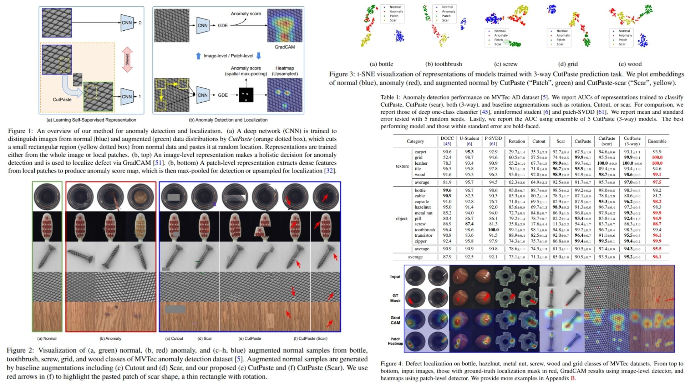

# 🖼 CutPaste-Replication — Self-Supervised Anomaly Detection

This repository provides a **faithful Python implementation** of the **CutPaste framework** for anomaly detection and localization.  
The goal is to **replicate the model from the paper** without full training/testing.

Highlights:

* Self-supervised **representation learning** 🌀  
* CutPaste / CutPaste-Scar augmentations ✂️  
* **Image & patch anomaly scoring** using Gaussian density $$\mathcal{N}(\mu, \Sigma)$$ 📊
  
Paper reference: *[CutPaste: Self-Supervised Learning for Anomaly Detection and Localization](https://arxiv.org/abs/2104.04015)*  

---

## Overview 🎨



> The framework learns embeddings from normal images and CutPaste-augmented versions.  
> Features are extracted via a **pretrained CNN**, optionally projected to embeddings, and used for **anomaly scoring** per image or patch.  

Key points:

* **CutPaste augmentation**: random patch cut & paste  
* **CutPaste-Scar**: thin-long patches for fine defects  
* **CNN backbone**: pretrained ResNet → embedding f(x)  
* **Proxy classifier**: normal vs CutPaste (training only)   
* **Anomaly score**: Gaussian density $$\log p(x) \propto -\frac{1}{2}(f(x)-\mu)^T \Sigma^{-1} (f(x)-\mu)$$ 📊  

---

## Core Math 📐

Training objective (image-level):

$$
\mathcal{L}_\text{CP} = \mathbb{E}_{x \in X} \big[ \text{CE}(g(x), 0) + \text{CE}(g(\text{CP}(x)), 1) \big]
$$

Patch-level objective:

$$
\mathcal{L}_\text{patch} = \mathbb{E}_{x \in X} \big[ \text{CE}(g(c(x)), 0) + \text{CE}(g(\text{CP}(c(x))), 1) \big]
$$

Anomaly score:

$$
\text{Score}(x) = (f(x) - \mu)^T \Sigma^{-1} (f(x) - \mu)
$$

---

## Why CutPaste Matters 🌿

* Learns **anomaly-sensitive representations** from normal images only 🧩  
* Detects **local defects** via both image-level and patch-level embeddings 🖼️🌀  
* Simple, efficient, and easy to experiment with ⚡  
* Modular design: extendable to different backbones or scoring methods 🔧  

---

## Repository Structure 🏗️

```bash
CutPaste-Replication/
├── src/
│   │ 
│   ├── augmentations/
│   │   ├── cutpaste.py               # f(x) → CutPaste augmentation: patch sampling & paste
│   │   └── utils.py                  # patch size, location sampling, random flip vb.
│   │
│   ├── model/
│   │   ├── backbone.py                # pretrained CNN → feature map
│   │   ├── classifier.py              # classifier head (normal vs cutpaste)
│   │   └── embedding_head.py          # optional: projection to embedding space
│   │
│   ├── pipeline/
│   │   └── forward_pass.py            # full flow: input → cutpaste → backbone → classifier → anomaly score
│   │
│   ├── scoring/
│   │   └── anomaly_score.py           # feature → distribution → score (e.g., Gaussian)
│   │
│   └── config.py                       # Hyperparameters: patch size, batch size, learning rate
│
├── images/
│   └── figmix.jpg               # paper’dan birebir blok diyagram
│
├── requirements.txt
│
└── README.md
```

---

## 🔗 Feedback

For questions or feedback, contact:  
[barkin.adiguzel@gmail.com](mailto:barkin.adiguzel@gmail.com)
